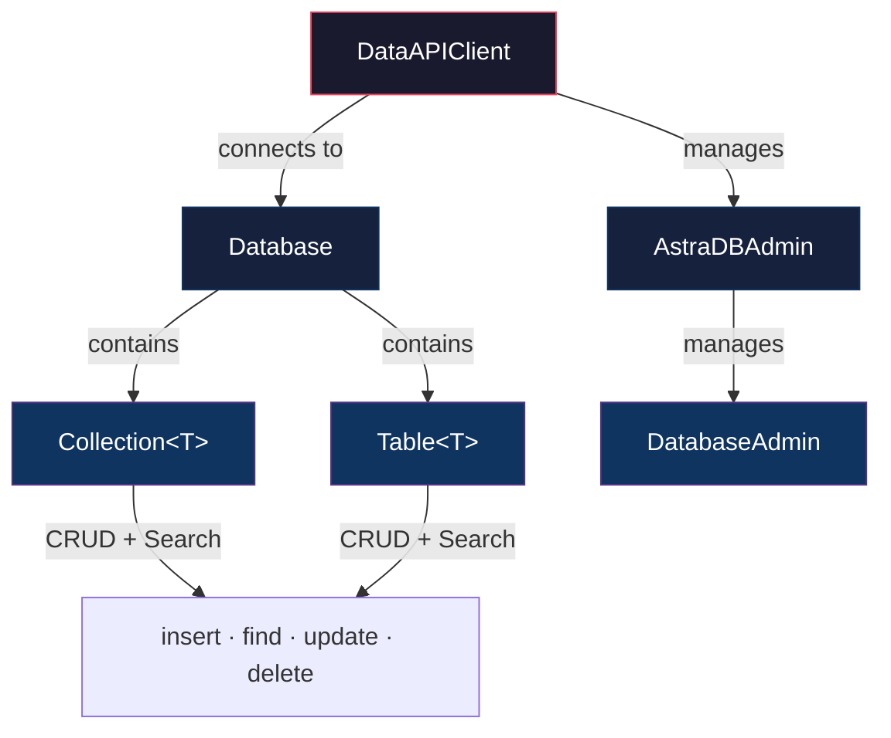

# Java Client for Data API

[](http://www.apache.org/licenses/LICENSE-2.0)
[](https://search.maven.org/artifact/com.datastax.astra/astra-db-java)
[](https://javadoc.io/doc/com.datastax.astra/astra-db-java/latest/index.html)
[](https://docs.datastax.com/en/astra-db-serverless/api-reference/dataapiclient.html)

A Java client for [DataStax Astra DB](https://astra.datastax.com).

This client library provides a simplified way to interact with the Data API for Astra DB Serverless, Hyper-Converged Database (HCD), or local instances.

### Key Features
* 🚀 **Zero-config:** Connect to Astra DB in 3 lines of code.
* 🔍 **Unified API:** Seamless support for **Collections** (JSON Documents) and **Tables** (Structured Rows).
* 🧠 **AI-Ready:** Native support for Vector Search and Server-side Embeddings (Vectorize).
* ☕ **Java-Centric:** Fluent builders, POJO mapping, and Jackson support.
* ⚡ **Sync & Async:** Built on `HttpClient` with full support for synchronous and asynchronous operations.

---

## Table of Contents

1. [Quickstart](#1-quickstart)
2. [Architecture Overview](#2-architecture-overview)
3. [Connecting to a Database](#3-connecting-to-a-database)
4. [Collections and Documents](#4-collections-and-documents)
5. [Tables and POJO Mapping](#5-tables-and-pojo-mapping)
6. [Support Functions](#6-support-functions)
7. [Running Tests](#7-running-tests-and-contributing)
8. [Help & Support](#8-help--support)
9. [Resources & Documentation](#9-resources--documentation)

---

## 1. Quickstart

### Prerequisites
* Java 17 or higher.
* An Astra DB **API Endpoint** and **Token** (get them at [astra.datastax.com](https://astra.datastax.com)).

### Installation

**Maven**
```xml
<dependency>
    <groupId>com.datastax.astra</groupId>
    <artifactId>astra-db-java</artifactId>
    <version>2.1.4</version>
</dependency>
```

**Gradle**
```groovy
implementation 'com.datastax.astra:astra-db-java:2.1.4'
```

### ⚡ Connect and Query in 30 Seconds

<details>
<summary><b>Click to view required imports</b></summary>

```java
import com.datastax.astra.client.DataAPIClient;
import com.datastax.astra.client.databases.Database;
import com.datastax.astra.client.collections.Collection;
import com.datastax.astra.client.collections.definition.CollectionDefinition;
import com.datastax.astra.client.collections.definition.documents.Document;
import com.datastax.astra.client.core.vector.SimilarityMetric;
import com.datastax.astra.client.core.query.Sort;
import com.datastax.astra.client.core.query.FindOptions;
import java.util.List;
import java.util.UUID;
```
</details>

```java
public class Quickstart {
    public static void main(String[] args) {
        // 1. Connect
        DataAPIClient client = new DataAPIClient("AstraCS:...");
        Database db = client.getDatabase("[https://01234567-....apps.astra.datastax.com](https://01234567-....apps.astra.datastax.com)");

        // 2. Create a vector collection
        Collection<Document> collection = db.createCollection(
            "dreams",
            CollectionDefinition.builder()
                .vector(3, SimilarityMetric.COSINE)
                .build()
        );

        // 3. Insert documents with vectors
        collection.insertMany(List.of(
            new Document()
                .id(UUID.fromString("018e65c9-e33d-749b-9386-e848739582f0"))
                .append("summary", "Riding the waves")
                .append("tags", List.of("sport"))
                .vector(new float[]{0f, 0.2f, 1f}),
            new Document()
                .append("summary", "Friendly aliens in town")
                .append("tags", List.of("scifi"))
                .vector(new float[]{-0.3f, 0f, 0.8f})
        ));

        // 4. Vector search
        List<Document> results = collection.find(
            new Document(),
            new FindOptions()
                .sort(Sort.vector(new float[]{0f, 0.2f, 0.4f}))
                .limit(2)
                .includeSimilarity(true)
        ).toList();

        results.forEach(doc ->
            System.out.println(doc.getString("summary") + ": " + doc.getSimilarity())
        );
    }
}
```

---

## 2. Architecture Overview

The SDK follows a layered hierarchy that mirrors the Data API itself.



| Layer | Purpose |
|-------|---------|
| **Client** | Entry point. Holds authentication token and HTTP configuration. |
| **Database** | Represents a single database/keyspace. Creates and retrieves collections and tables. |
| **Collection** | Document-oriented operations on schemaless JSON data (MongoDB-style). |
| **Table** | Row-oriented operations on structured, schema-defined data. |

---

## 3. Connecting to a Database

### 3.1 Astra DB Serverless

```java
import com.datastax.astra.client.DataAPIClient;
import com.datastax.astra.client.databases.Database;

// Connect with your Astra token
DataAPIClient client = new DataAPIClient("AstraCS:...");
Database database = client.getDatabase("[https://01234567-....apps.astra.datastax.com](https://01234567-....apps.astra.datastax.com)");
```

### 3.2 HCD and Local Installations

Connect to a Hyper-Converged Database (HCD), local DSE, or any Data API-compatible instance using a `UsernamePasswordTokenProvider`.

```java
import com.datastax.astra.client.DataAPIClient;
import com.datastax.astra.client.core.auth.UsernamePasswordTokenProvider;

TokenProvider tp = new UsernamePasswordTokenProvider("cassandra", "cassandra");
DataAPIClient client = new DataAPIClient(tp);
Database database = client.getDatabase("http://localhost:8181");
```

> **Tip:** Start a local HCD instance with `docker-compose up -d` using the `docker-compose.yml` included in this repository.

---

## 4. Collections and Documents

### 4.1 Working with Collections

#### Server-Side Embeddings (Vectorize)

Delegate embedding computation to the server by specifying a provider (e.g., OpenAI, NVIDIA, HuggingFace) at collection creation.

```java
Collection<Document> collection = database.createCollection(
    "my_vectorize_collection",
    CollectionDefinition.builder()
        .vectorize("openai", "text-embedding-3-small")
        .build()
);

// Insert — the server generates the embedding automatically
collection.insertOne(new Document().append("$vectorize", "A text passage to embed"));

// Search using natural language
List<Document> results = collection.find(
    new FindOptions().sort(Sort.vectorize("search query"))
).toList();
```

#### Filtering and Updates

```java
import com.datastax.astra.client.core.query.Filter;

// Find with a filter
List<Document> scifiDocs = collection.find(
    new Filter().where("tags", "scifi")
).toList();

// Update a document
collection.updateOne(
    new Filter().where("tags", "sport"),
    new Document().append("$set", new Document().append("summary", "Surfers' paradise"))
);
```

### 4.2 Working with Documents

The `Document` class is the primary data container for collections.

> 📖 **Deep Dive:** See the [Document API Reference](DOCUMENT-API.md) for full details on escaping rules, dot-notation access, and typed getters.

---

## 5. Tables and POJO Mapping

### 5.1 Working with Tables

Tables provide structured, schema-defined storage with full vector search support.

```java
// Define the schema
TableDefinition tableDef = TableDefinition.builder()
    .addColumn("dream_id", ColumnTypes.INT)
    .addColumn("summary", ColumnTypes.TEXT)
    .addVectorColumn("dream_vector", 3, SimilarityMetric.COSINE)
    .addPartitionBy("dream_id")
    .build();

Table myTable = database.createTable("dreams_table", tableDef);

// Insert rows
myTable.insertOne(
    new Row()
        .add("dream_id", 103)
        .add("summary", "Riding the waves")
        .add("dream_vector", new float[]{0f, 0.2f, 1f})
);
```

### 5.2 POJO Mapping (Object Mapping)

Map collections and tables directly to Java classes using Jackson annotations.

```java
public class Dream {
    @JsonProperty("_id")
    private int dreamId;

    @JsonProperty("$vector")
    private float[] vector;
    // ... getters/setters
}

// Get a typed collection
Collection<Dream> dreams = database.getCollection("dreams_collection", Dream.class);
dreams.insertOne(new Dream(500, ...));
```

---

## 6. Support Functions

* **Administration:** Use `client.getAdmin()` to manage databases and `database.getDatabaseAdmin()` to manage keyspaces.
* **Logging:** The client uses SLF4J. Configure Logback or Log4j2 to see debug logs.
* **Error Handling:** Catch `DataAPIFaultyResponseException` for API errors and `DataAPIHttpException` for network issues.

---

## 7. Running Tests and Contributing

We welcome contributions!

For details on running the test suite (Local, Dev, Prod), configuring environment variables, and our coding standards, please see **[CONTRIBUTING.md](CONTRIBUTING.md)**.

---

## 8. Help & Support

If you encounter any issues or have questions:
* 🐛 **Report Bugs:** Open an issue on [GitHub Issues](https://github.com/datastax/astra-db-java/issues).
* 💬 **Community:** Join the discussion on the [DataStax Discord](https://discord.com/invite/datastax).
* 📚 **StackOverflow:** Tag questions with `astra-db`.

---

## 9. Resources & Documentation

**Astra DB Serverless**
- [Quickstart: Collections](https://docs.datastax.com/en/astra-db-serverless/get-started/quickstart.html)
- [Quickstart: Tables](https://docs.datastax.com/en/astra-db-serverless/get-started/quickstart-tables.html)
- [API Reference](https://docs.datastax.com/en/astra-db-serverless/api-reference/dataapiclient.html)

**Hyper-Converged Database (HCD)**
- [Quickstart: Collections](https://docs.datastax.com/en/hyper-converged-database/1.2/api-reference/quickstart.html)
- [Quickstart: Tables](https://docs.datastax.com/en/hyper-converged-database/1.2/api-reference/quickstart-tables.html)

---

<p align="center">
  Copyright © 2024 DataStax. Distributed under the Apache License 2.0.
</p>