# Data API with HCD in Mission Control

This guide walks you through setting up and accessing the Data API with Hyper-Converged Database (HCD) in Mission Control using Google Kubernetes Engine (GKE).

## Prerequisites

- Access to the `k8ssandra` GCP project (contact Alexander D. for permissions)
- IBM/Datastax email address for authentication
- Basic familiarity with Kubernetes and command-line tools

## Table of Contents

1. [gcloud CLI Configuration](#1-gcloud-cli-configuration)
2. [Kubernetes Client Setup](#2-kubernetes-client-setup)
3. [List Organizations](#3-list-organizations)
4. [List Clusters](#4-list-clusters)
5. [Create a New Cluster](#5-create-a-new-cluster)
6. [Setup Data API](#6-setup-data-api)

---

## 1. gcloud CLI Configuration

> **Reference:** [Google Cloud SDK Installation Guide](https://docs.cloud.google.com/sdk/docs/install-sdk)

### Install gcloud CLI

Download and extract the Google Cloud SDK (ARM version for macOS):

```bash
# Download the SDK
curl -O https://dl.google.com/dl/cloudsdk/channels/rapid/downloads/google-cloud-cli-darwin-arm.tar.gz

# Extract the archive
tar -xf google-cloud-cli-darwin-arm.tar.gz

# Run the installation script
./google-cloud-sdk/install.sh
```

### Initialize and Authenticate

```bash
# Initialize gcloud CLI
gcloud init

# List authenticated accounts
gcloud auth list

# Authenticate with your IBM/Datastax email
gcloud auth login

# List available projects
gcloud projects list

# Set k8ssandra as the default project
gcloud config set project k8ssandra
```

### Install GKE Components

```bash
# Install the GKE authentication plugin
gcloud components install gke-gcloud-auth-plugin

# List available clusters
gcloud container clusters list
```

**Expected output:**

```
NAME                  LOCATION       MASTER_VERSION      MASTER_IP       MACHINE_TYPE   NODE_VERSION        NUM_NODES  STATUS
rad-ingress-test      us-central1-a  1.33.5-gke.2326000  35.193.248.128  e2-standard-4  1.33.5-gke.2326000  3          RUNNING
ui-playground-new     us-central1-a  1.33.5-gke.2228001  34.44.121.239   e2-standard-4  1.33.5-gke.2228001  11         RUNNING
ui-playground-new-dp  us-central1-a  1.33.5-gke.2326000  34.136.191.13   e2-standard-4  1.33.5-gke.2326000  1          RUNNING
temporal-oss          us-central1-c  1.33.5-gke.2326000  34.46.16.158    n2-standard-8  1.33.5-gke.2326000  5          RUNNING
temporal-oss-2        us-central1-c  1.33.5-gke.2326000  34.67.152.118   e2-standard-4  1.33.5-gke.2326000  3          RUNNING
temporal-oss-jeff     us-central1-c  1.34.3-gke.1245000  34.45.75.50     e2-standard-4  1.34.3-gke.1245000  1          RUNNING
```

---

## 2. Kubernetes Client Setup

### Connect to the Cluster

```bash
# Retrieve credentials for ui-playground-new cluster
gcloud container clusters get-credentials ui-playground-new \
  --region=us-central1-a \
  --project=k8ssandra
```

**Expected output:**

```
Fetching cluster endpoint and auth data.
kubeconfig entry generated for ui-playground-new.
```

### Verify Connection

```bash
# Get cluster information
kubectl cluster-info
```

**Expected output:**

```
Kubernetes control plane is running at https://**.**.**.**
GLBCDefaultBackend is running at https://**.**.**.**/api/v1/namespaces/kube-system/services/default-http-backend:http/proxy
KubeDNS is running at https://**.**.**.**/api/v1/namespaces/kube-system/services/kube-dns:dns/proxy
Metrics-server is running at https://**.**.**.**/api/v1/namespaces/kube-system/services/https:metrics-server:/proxy
```

---

## 3. List Organizations

### Access Mission Control UI

1. Navigate to: https://mc-ui.k8ssandra.io/
2. Authenticate using your W3 login credentials

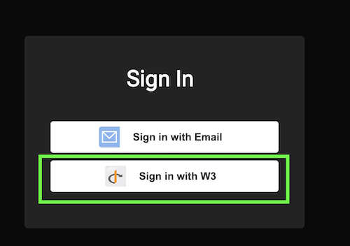

3. Locate the **Data API Integration** organization

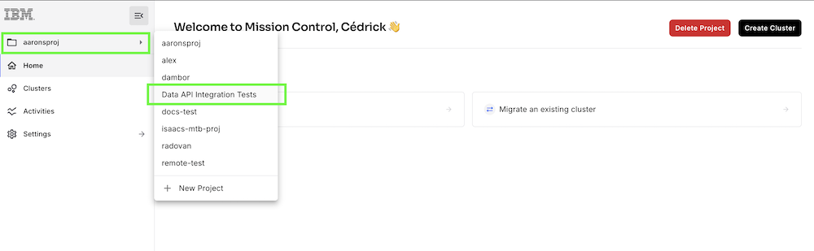

### List Organizations via kubectl

Each organization in Mission Control corresponds to a Kubernetes namespace:

```bash
kubectl get ns | grep data-api
```

**Expected output:**

```
data-api-integration-tests-y42ou8ut   Active   83d
```

---

## 4. List Clusters

### View Clusters in UI

Navigate to your organization to see available clusters:

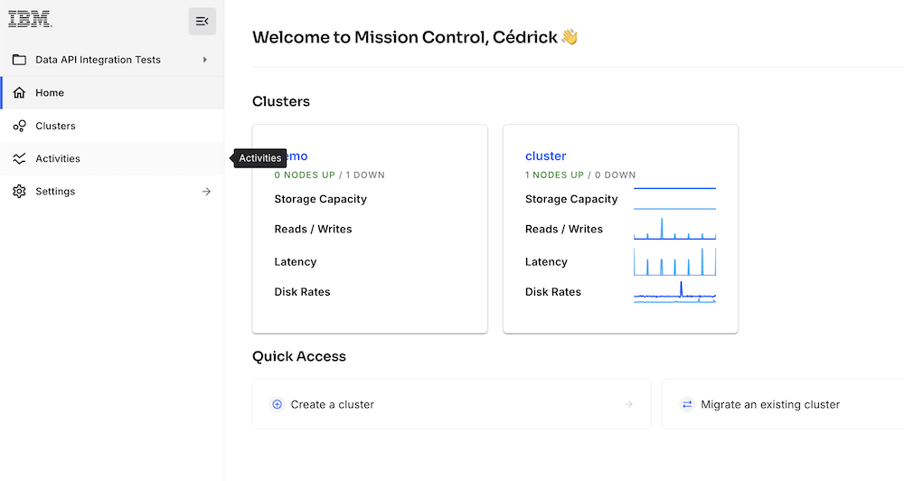

### List Clusters via kubectl

```bash
kubectl get svc -n data-api-integration-tests-y42ou8ut
```

Each cluster has multiple associated services in its namespace.

---

## 5. Create a New Cluster

### Step 1: Initialize Cluster Creation

1. In the Mission Control UI, click **Create Cluster**
2. Enter a cluster name (e.g., `demo`)
3. Select **HCD** as the cluster type

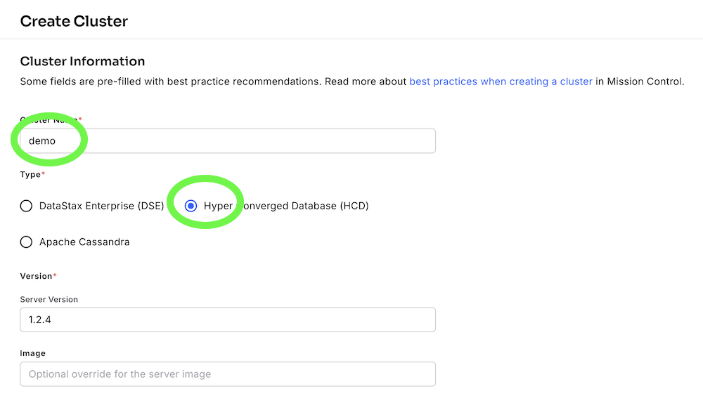

### Step 2: Configure Data Center

1. Select **Single DC** deployment
2. Provide a data center name (default: `dc-1`)
3. Provide a rack name (default: `rack-name`)

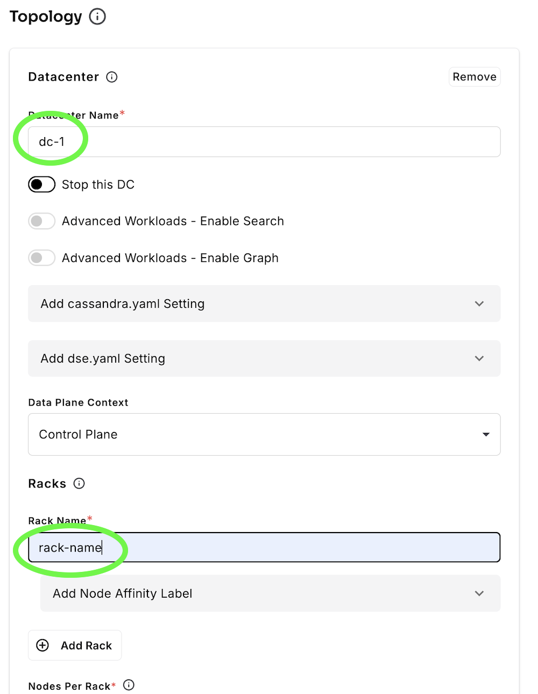

### Step 3: Configure Storage and Credentials

1. Select storage class: `standard` (recommended for testing)
2. Configure superuser credentials:
- **Username:** Leave empty to use `<clustername>-superuser`
- **Password:** Leave empty to auto-generate

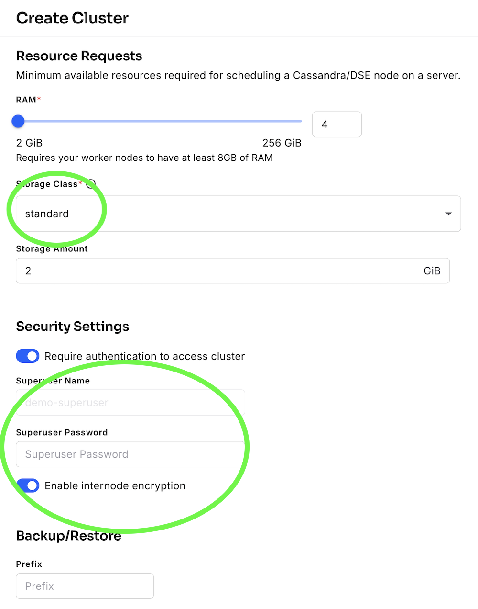

### Step 4: Wait for Initialization

The cluster will take several minutes to initialize:

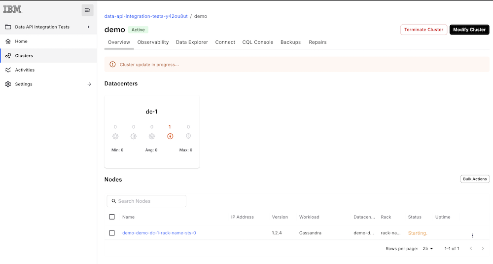

### Verify Cluster Services

```bash
kubectl get svc -n data-api-integration-tests-y42ou8ut
```

### Retrieve Cluster Credentials

```bash
# Get username
kubectl get secret demo-superuser \
  -n data-api-integration-tests-y42ou8ut \
  -o jsonpath="{.data.username}" | base64 -d

# Get password
kubectl get secret demo-superuser \
  -n data-api-integration-tests-y42ou8ut \
  -o jsonpath="{.data.password}" | base64 -d
```

---

## 6. Setup Data API

### Step 1: Create a Gateway

1. Navigate to the **Connect** tab
2. Select **Data API**
3. Click **Create Gateway**

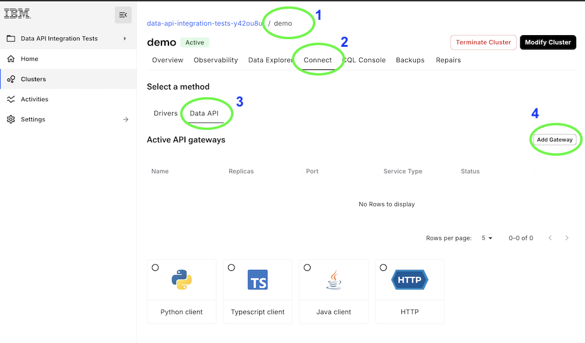

### Step 2: Configure Gateway Port

Choose a port number above 30000:

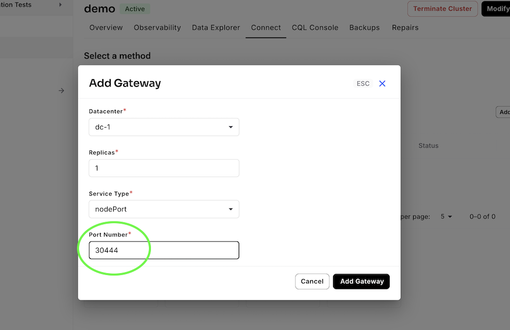

**Note:** The gateway will initially show an ERROR state:

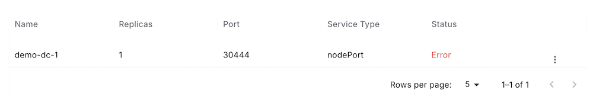

After a few seconds, it should transition to ACTIVE:

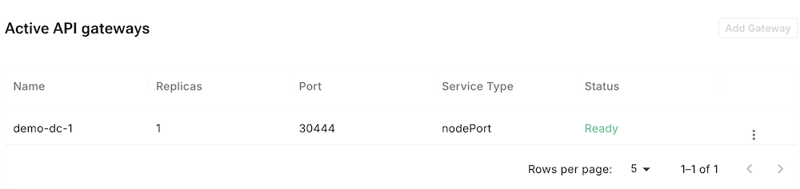

> ⚠️ If the gateway remains in ERROR state, the port may already be in use. Try a different port number.

### Step 3: Get External IP Address

As of February 2026, ingress is not yet configured. You'll need to manually retrieve the external IP:

```bash
# List gateway services
kubectl get svc -n data-api-integration-tests-y42ou8ut | grep data-api
```

**Expected output:**

```
demo-dc-1-data-api-np   NodePort    12.123.123.12   <none>        8181:30444/TCP   11m
```

```bash
# Get node external IPs
kubectl get nodes -o wide
```

**Expected output:**

```
NAME                                               STATUS   ROLES    AGE     VERSION               INTERNAL-IP     EXTERNAL-IP       OS-IMAGE
gke-ui-playground-new-default-pool-b6a52a69-0m7y   Ready    <none>   6d13h   v1.33.5-gke.2228001   10.128.0.98     123.123.123.123   Container-Optimized OS from Google
gke-ui-playground-new-default-pool-b6a52a69-22ma   Ready    <none>   6d13h   v1.33.5-gke.2228001   10.128.0.14     124.124.124.124   Container-Optimized OS from Google
```

### Step 4: Test Data API Connection

```bash
# Set environment variables
export HCD_URL="<external_ip_from_above>"
export HCD_GATEWAY_PORT="<gateway_port_from_above>"
export HCD_USERNAME="demo-superuser"
export HCD_PASSWORD="<password_from_secret>"
export HCD_USERNAME_B64=$(echo -n "$HCD_USERNAME" | base64)
export HCD_PASSWORD_B64=$(echo -n "$HCD_PASSWORD" | base64)

# Test connection by listing keyspaces
curl -X POST "http://${HCD_URL}:${HCD_GATEWAY_PORT}/v1" \
  -H "Content-Type: application/json" \
  -H "Accept: application/json" \
  -H "Token: Cassandra:${HCD_USERNAME_B64}:${HCD_PASSWORD_B64}" \
  -d '{"findKeyspaces":{}}'
```

**Expected output:**

```json
{
  "status": {
    "keyspaces": [
      "system_auth",
      "system_schema",
      "system_distributed",
      "system",
      "reaper_db",
      "system_traces",
      "system_views",
      "system_virtual_schema"
    ]
  }
}
```

> ⚠️ If the command hangs, you may need to request a firewall port opening.

---

## Troubleshooting

- **Gateway stuck in ERROR state:** The selected port may be in use. Choose a different port above 30000.
- **Connection timeout:** Verify firewall rules allow traffic on the gateway port.
- **Authentication failed:** Double-check credentials retrieved from Kubernetes secrets.
- **Cluster not appearing:** Ensure you have proper permissions in the `k8ssandra` GCP project.

## Additional Resources

- [Google Cloud SDK Documentation](https://cloud.google.com/sdk/docs)
- [Kubernetes Documentation](https://kubernetes.io/docs/home/)
- [Mission Control Documentation](https://mc-ui.k8ssandra.io/)

---

**Last Updated:** February 2026